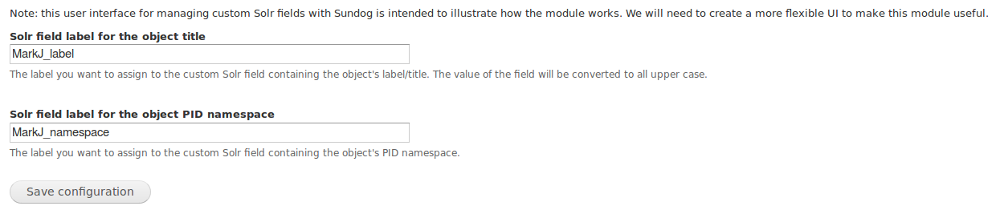
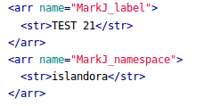
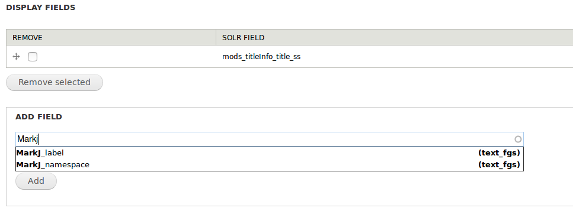

# Islandora Sundog

Experimental module that adds fields to Solr by bypassing Fedora GSearch. The motivation for doing this is that adding custom fields to Solr is typically done by modifying the XSLT stylesheets invoked by GSearch. This requires access to the server GSearch is running on, and also... modifying XSLT stylesheets on the server GSearch is running on. This module implements an alternative way of adding additional fields to Solr, for example, to customize searching and metadata display.

# Background

It is possible to [update and add specific fields](https://cwiki.apache.org/confluence/display/solr/Updating+Parts+of+Documents) to Solr documents using calls to Solr's HTTP `/update` endpoint, such as:

```
curl -v http://localhost:8080/solr/update -H 'Content-type:application/json' -d @test.json
```

where the file test.json contains:

```json
[
 {"PID"       : "newpdf:5",
  "dc.description"   : {"set":"I have been updated."}
 }
]
```

Add new fields uses a similar operation. Significantly, 

1. it is possible to add entirely new fields that don't need to be defined in your Solr schema, and
1. these new fields show up in Islandora's user interfaces for defining custom metadtata display and advanced search options.

For example, with this test.json:

```json
[
 {"PID"       : "newpdf:5",
  "footest"   : {"set":"Is this field showing up in Solr?"}
 }
]
```

This shows up in the Solr document for newpdf:5:

```xml
 <arr name="footest">
      <str>Is this field showing up in Solr?</str>
 </arr>
```

# Limitations

This technique for adding data to an Islandora's Solr index has a couple of limitations:

* it only works if the Solr document corresponding to an Islandora object already exists. Indexing Solr via GSearch after object ingestion or update takes a few seconds, so we cannot use Islandora's hook_islandora_object_ingested(), hook_islandora_datastream_modified(), etc. to add our data to Solr. Therefore, we wait until GSearch has finished before we add fields in a Solr document using Solr's `/update` HTTP endpoint. To work around this problem, we fire the HTTP request to `/update` in a background process that waits a specific amount of time (say 10 seconds), invisibly to the end user, after object/datastream ingest or update.
* we can only add fields of the type "string" to Solr, and not "text", "boolean", etc. This means that Solr does no tokenization or other types of processing on the data. So for example, if we want our data to be normalized to lowercase, we need to do it ourselves before we add it to Solr. It is posible to add multivalued fields.

## Requirements

* [Islandora](https://github.com/Islandora/islandora)
* [Background Process](https://www.drupal.org/project/background_process)

## Usage

This module is currently experimental. All you need to do is enable it, there are no configuration options or user interface. However, those will come soon, once the basic technique this module illustrates is more robust.

Currently, options for determining the field labels of two custom fields is available. The content of these fields is not configurable. To try these fields out:

1. Go to the admin form at `admin/islandora/tools/sundog`. Enter the field labels you want for your two custom fields:
  * 
1. Save your settings.
1. Trigger the addition of these two fields to an object's Solr document by editing a datastream (MODS, for example).
1. Visit your local Solr (http://localhost:8080/solr/#/collection1/query) to see the new fields. Query for the PID of the object you modified by entering the following in the query field: `PID:mypid\:1234` (where "mypid:1234" is the PID you want to query). Near the bottom of the results, you should see your custom fields:
  * 
1. To see the custom fields show up in the Islandora Solr module's metadata display configuration tool, for example, try to add one of your custom fields to a metadata display:
  * 

## To do

* Add some useful examples of new Solr fields
* Add a rudimentary UI for allowing Islandora admins to control what goes in their custom Solr fields

## Maintainer

* [Mark Jordan](https://github.com/mjordan)

## Development and feedback

Pull requests are welcome, as are use cases and suggestions.

## Further Development

## License

 [GPLv3](http://www.gnu.org/licenses/gpl-3.0.txt)
